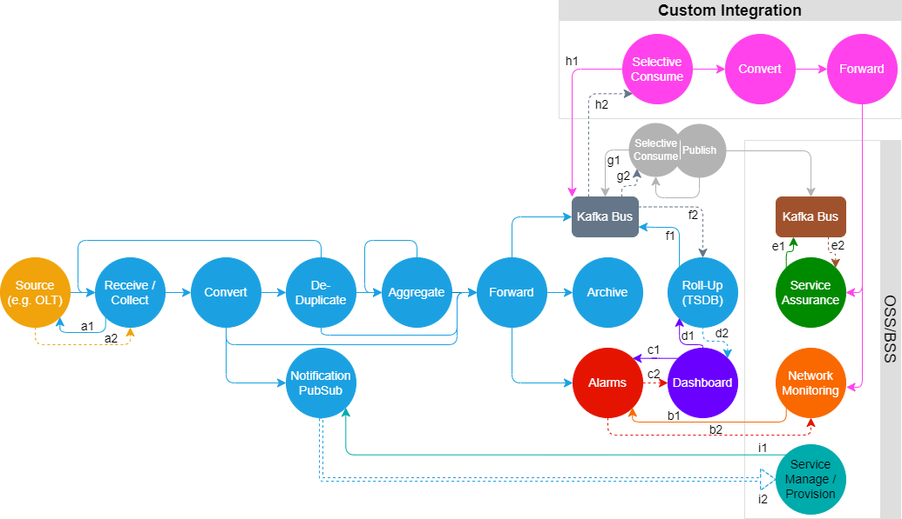
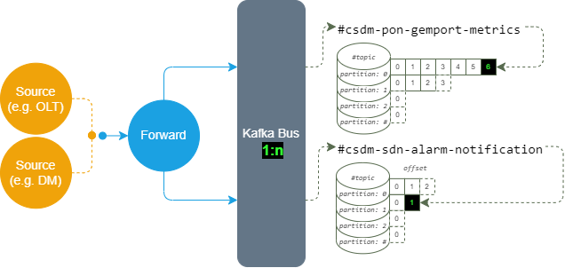
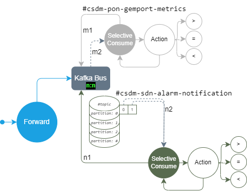
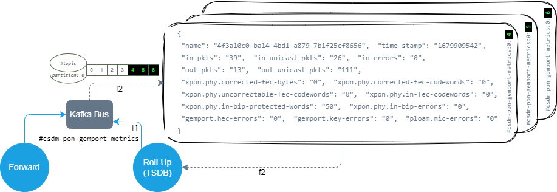

<!--- npx @marp-team/marp-cli@latest SE.md -o SE.pdf --pdf --allow-local-files --pdf-outlines --title "FLX PON - DM Northbound APIs, NETCONF/YANG & Telemetry (Kafka & TSDB)"; npx @marp-team/marp-cli@latest SE.md -o SE.html --html --allow-local-files --title "FLX PON - DM Northbound APIs, NETCONF/YANG & Telemetry (Kafka & TSDB)"; npx @marp-team/marp-cli@latest SE.md -o SE.pptx -->
<!-- backgroundImage: "linear-gradient(to bottom, #13aaed, #0801)" -->
# CommScope® FLX™ Domain Manager

## Northbound APIs, NETCONF/YANG & Telemetry

> lee cowdrey


---

<!-- backgroundImage: "" -->
<!-- footer: "FLX PON © 2023 CommScope, Inc." -->

# PON End-to-End


---

<!-- backgroundImage: "linear-gradient(to bottom, #13aaed, #0801)" -->
# Northbound APIs

---

<!-- backgroundImage: "" -->

## OpenAPI Specification (OAS)

> The OpenAPI Specification, previously known as the Swagger Specification, is a specification for a machine-readable interface definition language for describing, producing, consuming and visualizing web services
- Specification (service contract) can be formatted either as:
  - `JSON`
  - `YAML`
- [https://swagger.io/specification/](https://swagger.io/specification/)
  - Domain Manager currently conforming to version `3.0.3`

> OpenAPI is simply machine documentation

---

## Using OpenAPIs - Why & What

- API Gateway products can automatically digest OpenAPI definitions exposed by microservices and subsequently support there operation of (i.e. service-mesh routing, OSS/BSS service catalog and order management systems) without the need for complex integration activities
    - cloud based such as [AWS API Gateway](https://docs.aws.amazon.com/apigateway/latest/developerguide/api-gateway-import-api.html)
    - data centre based such as [Kong](https://konghq.com/blog/service-design-guidelines-with-openapi-and-kong-part-i) and [Apigee Edge API Proxy](https://docs.apigee.com/api-platform/tutorials/create-api-proxy-openapi-spec)
- Other products can generate *ready to use* code snippets from digested OpenAPI definitions for inclusion into source code, or actually generate full testing suites to verify definitions
> If an API design workflow is followed, it becomes single source of truth of all APIs reducing development effort

---

## OpenAPI Artifacts

- Domain Manager OpenAPI service contract available from [https://arris.flexnetoperations.com/control/arrs/download?element=13837527](Flexera)
  - generated as part of CI/CD release
- API Integration Guide also available via Flexera as part of Domain Manager documentation set
> However, most developers will *just* use an OpenAPI editor to determine URL and payloads

---

## OpenAPI Editor (1)

- Available within Domain Manager UI
  - automatically includes OpenAPI service contract
  - URL path should contain `/halodocs/#`
  

---

## OpenAPI Editor (2)
- Available externally at [https://editor-next.swagger.io/](https://editor-next.swagger.io/)
  - requires manually loading of OpenAPI service contract
  
- Expected to be used by system integrators

---

## RESTful API Tooling

- Many tools/extensions available at zero cost for Linux, Windows and macOS platforms:
  - [Postman](https://www.postman.com/)
  - [Thunder Client](https://www.thunderclient.com/)
    - requires Microsoft [Visual Studio Code](https://code.visualstudio.com/)
  - [CURL CLI utility](https://curl.se/)
---

## Postman


---

## Thunder Client


---

## Domain Manager APIs - PON focused


---

## Domain Manager API Usage


---

## Domain Manager API Login Credentials

- Default
  - `client_id`: `test-client`
  - `client_secret`: `halo-test-client-secret`
  - `grant_type`: `client_credentials`
- New/deployment specific credentials can be created via KeyCloak Admin portal or `kc_createClient.sh` utility script

---

## Domain Manager API Login

- Method: `POST`
- URL: `https://{{dm-host}}:{{dm-port}}/auth/realms/halo/protocol/openid-connect/token`
- Request Body: x-www-form-urlencoded with `client_id={{u}}`,`client_secret={{p}}`,`grant_type={{t}}`
- Headers: `Accept: application/json` `Cache-Control: no-cache`
- Response Status code: `200 Ok`
- Response Body
```json
  { "access_token": "eyJhbGciOiJS...SMdxw", "expires_in": 300, "refresh_expires_in": 0,
    "token_type": "Bearer", "not-before-policy": 0, "scope": "email profile" }
```

---

## Domain Manager API Login - CURL Example

```bash
$ export JWT_TMP=$(mktemp --quiet --suffix=.json --tmpdir=/tmp XXXXXXXX)
$ curl --insecure \
       -o ${JWT_TMP} \
       --connect-timeout 20 \
       --max-time 60 \
       --user-agent "halo-test/1.0" \
       --request POST \
       --header "Content-Type: application/x-www-form-urlencoded" \
       --header "Accept: application/json" \
       --header "Cache-control: no-cache" \
       --data "client_id=test-client" \
       --data "grant_type=client_credentials" \
       --data "client_secret=halo-test-client-secret" \
       "https://212.250.153.243/auth/realms/halo/protocol/openid-connect/token"
$ export JWT=$(jq -r ".token_type+\" \"+.access_token" ${JWT_TMP}) && rm -f ${JWT_TMP}
```
---

## Domain Manager API Operational

- Method: `GET`|`POST`|`PUT`|`DELETE`|`PATCH`
- URL: `https://{{dm-host}}:{{dm-port}}/...`
- Request Body: `raw` `{...}`
- Headers: `Authorization: Bearer {{access_token from login}}` `Accept: application/json` `Content-Type: application/json` `Cache-Control: no-cache`
- Response Status code: `2xx`
- Response Body: `{...}`
> available APIs as stated in Domain Manager API usage

---

## Domain Manager API Operational - CURL Example

```bash
$ export GET_TMP=$(mktemp --quiet --suffix=.json --tmpdir=/tmp XXXXXXXX)
$ curl --insecure \
       -o ${GET_TMP} \
       --connect-timeout 20 \
       --max-time 60 \
       --user-agent "halo-test/1.0" \
       --request GET \
       --header "Accept: application/json" \
       --header "Cache-control: no-cache" \
       --header "Authorization: ${JWT}" \
       "https://212.250.153.243/controller/v1/devices?elementFamily=PON-OLT"
$ cat ${GET_TMP}|jq|head
{
  "numElements": 1,  "pageElements": 1,  "pageSize": 1000,  "pageNumber": 1,
  "devices": [
    {
      "elementName": "belf-dmz-olt","groupId": "Default", "description": "",
```

---
<!--
## Domain Manager API Operational - POSTMAN Example


---

## Domain Manager API Operational - Thunder Client Example


---
--->
## Domain Manager API Logout
- Method: `GET`
- URL: `https://{{dm-host}}:{{dm-port}}/auth/realms/halo/protocol/openid-connect/logout`
- Request Body: none
- Headers: `Authorization: Bearer {{access_token from login}}` `Accept: */*` `Cache-Control: no-cache`
- Response Status code: `200 Ok`

---

## Domain Manager API Logout - CURL Example

```bash
$ curl \
    --insecure \
    -o /dev/null \
    --connect-timeout 20 \
    --max-time 60 \
    --user-agent "halo-test/1.0" \
    --request GET \
    --header "Accept: */*" \
    --header "Cache-control: no-cache" \
    --header "Authorization: ${JWT}" \
    "https://212.250.153.243/auth/realms/halo/protocol/openid-connect/logout"
```

---

<!-- backgroundImage: "linear-gradient(to bottom, #13aaed, #0801)" -->
# NETCONF/YANG

---

<!-- backgroundImage: "" -->
## What is Data Model?


- A data-model determines the structure, syntax and semantics of the data…
  - that is externally visible
  - Consistent and complete
- Protocol
  - Remote primitives to view and manipulate the data
    -Encoding of the data as defined by the data-model

---

## What is YANG (1)

- **YANG** is a **data modeling language** used to model configuration and state data manipulated by the **Network Configuration Protocol** (NETCONF), NETCONF remote procedure calls, and NETCONF notifications.
- **YANG 1.0** is defined in **RFC6020**.
  - Describe syntax and semantics of the YANG language
  - Also describe how a data model defined in a YANG module is encoded in the Extensible Markup Language (XML) and how NETCONF operations are used to manipulate the data
- **YANG 1.1** is defined in **RFC7950**
  - Describe syntax and semantics of version 1.1 of the YANG language
  - It is a maintenance release of the YANG language, addressing defects in the original specification - it does not obsolete RFC6020

---

## What is YANG (2)

- YANG modules can be translated into an equivalent XML syntax called YANG Independent Notation (YIN), allowing applications using XML parsers and Extensible Stylesheet Language Transformations (XSLT) scripts to operate on the models.
- YANG maintains compatibility with the Simple Network Management Protocol's (SNMP's) SMIv2. SMIv2-based MIB modules can be automatically translated into YANG modules for read-only access
- The YANG language was developed by the IETF NETCONF Data Modelling Language Working Group [NETMOD](http://www.ietf.org/html.charters/netmod-charter.html)

---

## Relationship between NETCONF and YANG

- The **NETCONF protocol** is a formal application programming interface (API) that allows configuration data information to be retrieved and manipulated
- The **YANG data modeling language** is used to model configuration and state data manipulated by NETCONF
- NETCONF is **not replacing** CORBA/SOAP/REST; it provides full set of semantics for configuration management
- YANG is **not replacing** XSD/RelaxNG/WSDL; it provides many features specific to configuration management

---

## SNMP vs. NETCONF

|                         | SNMP             | NETCONF           |
| ----------------------- | ---------------- | ----------------- |
| Standard                | IETF             | IETF              |
| Resources               | OIDs             | Paths             |
| Data Models             | Defined in MIBs  | YANG Core Models  |
| Data Modelling Language | SMI              | YANG              |
| Management Operations   | SNMP             | NETCONF           |
| Encoding                | BER              | XML               |
| Transport  Stack        | UDP              | SSH, TCP          |

---

## NETCONF and YANG in Context


---

## YANG Module Contents


---

## YANG Module


---

## 4 Hours of NETCONF/YANG Training

- [Part 1](https://commscope.sharepoint.com/:v:/r/sites/TM_PONDeployment/Training/PON%20Internal%20Technical%20Training/YANG%20%26%20NETCONF/part1of2.mp4?csf=1&web=1&e=oJh7uB)
- [Part 2](https://commscope.sharepoint.com/:v:/r/sites/TM_PONDeployment/Training/PON%20Internal%20Technical%20Training/YANG%20%26%20NETCONF/part2of2.mp4?csf=1&web=1&e=62PeT5)
- [ietf-interfaces@2018-02-20.yang](https://commscope.sharepoint.com/:u:/r/sites/TM_PONDeployment/Training/PON%20Internal%20Technical%20Training/YANG%20%26%20NETCONF/ietf-interfaces@2018-02-20.yang?csf=1&web=1&e=h3D1L3)
- [ietf-yang-types@2013-07-15.yang](https://commscope.sharepoint.com/:u:/r/sites/TM_PONDeployment/Training/PON%20Internal%20Technical%20Training/YANG%20%26%20NETCONF/ietf-yang-types@2013-07-15.yang?csf=1&web=1&e=9FCvc7)
- [YANG_Cheat_Sheet.pdf](https://commscope.sharepoint.com/:b:/r/sites/TM_PONDeployment/Training/PON%20Internal%20Technical%20Training/YANG%20%26%20NETCONF/YANG_Cheat_Sheet.pdf?csf=1&web=1&e=twacaL)
- [yangPrimer.pdf](https://commscope.sharepoint.com/:b:/r/sites/TM_PONDeployment/Training/PON%20Internal%20Technical%20Training/YANG%20%26%20NETCONF/yangPrimer.pdf?csf=1&web=1&e=DNTee5)

<!--
---

## YANG Tooling - pyang

- An extensible YANG (RFC 6020/7950) validator.
- Provides a framework for plugins that can convert YANG modules to other formats.
- Command-line tool written in Python, XSLT and sh/bash.
- Extensible via plugins.
- Under active development, some plugins and bug fixes only available on GitHub.
- RTFM: Unix man pages  pyang(1)
  - [http://www.yang-central.org/twiki/pub/Main/YangTools/pyang.1.html](http://www.yang-central.org/twiki/pub/Main/YangTools/pyang.1.html)

---

#### pyang plugins

- Conversion to various formats, activated with -f.
- Most plugins have specific command-line switches and arguments.
- yin,yang – YIN and YANG syntax,
- dsdl – DSDL hybrid schema (RFC 6110),
- xsd, - W3C XML Schema,
- tree – schema tree (ASCII art),
- xml, uml – UML diagrams,
- jstree – HTML/JavaScript YANG browser,
- etc.

---

#### pyang installation (RedHat based)

- Download pyang to environment [https://github.com/mbj4668/pyang](https://github.com/mbj4668/pyang), then

```bash
~$: unzip pyang-master.zip
~$: cd pyang-master
~$: # install python if the server doesn’t have
~$: yum install python-setuptools
~$: python setup.py install
```

---

#### pyang installation (Debian based)

```bash
~$: sudo apt-get install -y python3-pip
~$: sudo pip3 install pyang
~$: pyang -v
pyang 2.5.3
```

---

#### pyang essentials

- Check module correctness

```bash
~$: pyang ietf-interface@2018-02-20.yang
```

- If there is no error, nothing will be retuned for output.
- But if there is syntax error, the error details will be shown in output, e.g.

```bash
~$: pyang ietf-interface@2018-02-20.yang
ietf-interface.yang:105: error: syntax error: illegal keyword: ;
```

> The syntax error is inidicating `;` is illegal

---

#### pyang essentials

- generate tree diagram

```bash
$ pyang -f tree ietf-interface@2018-02-20.yang
module: ietf-interface
    +--rw interfaces
       +--rw interfaces* [name]
       |  +--rw name                        string
       |  +--rw enabled?                    boolean
       |  +--rw link-up-down-trap-enable?   enumeration
       +--ro interfaces-state* [name]
          +--ro name            string
          +--ro admin-status    enumeration
          +--ro oper-status?    enumeration
          +--ro last-change?    yang:date-and-time
...
```

---

#### pyang essentials - help on tree symbols

```bash
$ pyang --tree-help
Each node is printed as:
<status> <flags> <name> <opts> <type> <if-features>
  <status> is one of:
    +  for current
    x  for deprecated
    o  for obsolete
  <flags> is one of:
    rw  for configuration data
    ro  for non-configuration data
    -x  for rpcs and actions
    -n  for notifications
  <name> is the name of the node
    (<name>) means that the node is a choice node
   :(<name>) means that the node is a case node
```
-->
---

<!-- backgroundImage: "linear-gradient(to bottom, #13aaed, #0801)" -->
# CommScope Domain Manager (CSDM)
# with NETCONF & OLT Operations

---

<!-- backgroundImage: "" -->
<!-- footer: "FLX PON © 2023 CommScope, Inc." -->

### OLT - Boot Sequence


---

### OLT - NETCONF Mount Operation


---

### OLT - NETCONF Edit Operation (1/5)


---

### OLT - NETCONF Edit Operation (2/5)


---

### OLT - NETCONF Edit Operation (3/5)


---

### OLT - NETCONF Edit Operation (4/5)


---

### OLT - NETCONF Edit Operation (5/5)


---

### OLT - NETCONF Keep-Alive Operation


---

### OLT - NETCONF Unmount Operation


---

<!-- backgroundImage: "linear-gradient(to bottom, #13aaed, #0801)" -->
# CommScope Domain Manager (CSDM)
# monitoring NETCONF & OLT Operations

---

<!-- backgroundImage: "" -->
<!-- footer: "FLX PON © 2023 CommScope, Inc." -->

## Accessing SDNc (lighty.io)

- access Kubernetes (K8S) compute hosting Domain Manager
  - example host `10.173.255.61`
  - host username typically `labuser`
  - host password typically `Broadbus1`
- Find the `csdm-sdn-app` K8S pod (or leader)

```bash
~$: ssh labuser@10.173.255.61
```
```bash
labuser:~$: kubectl exec --stdin --tty csdm-sdn-app-0 -n csdm -- /bin/bash
root@csdm-sdn-app-0:/csdm-sdn-app# tail -1f $(grep "log4j.appender.file.File=" csdm-sdn-config/log4j.properties | cut -d"=" -f2)
root@csdm-sdn-app-0:/csdm-sdn-app# exit
```

- or for offline viewing/diagnosis:

```bash
labuser:~$: kubectl cp csdm/csdm-sdn-app-0:/var/log/csdm/csdm.log /tmp/csdm.log
labuser:~$: view /tmp/csdm.log
```

---

## Verifying SDNc (lighty.io) Core Components Startup
- SDN controller
- RESTCONF northbound module
- NETCONF southbound module
- NETCONF call home plugin

```bash
~$: grep "Starting lighty.io" csdm.log
... - Starting lighty.io controller (MD-SAL, Controller, YangTools,...)
... - Starting lighty.io RESTCONF northbound module
... - Starting lighty.io NETCONF southbound module
... - Starting lighty.io NETCONF Call Home Plugin
```

---

## Verifying SDNc (lighty.io) CSDM Components Startup

- CSDM application
- core module
- call home, PubSub, Topology, XNF, SKU, Pools features

```bash
~$: grep "Starting csdm" csdm.log
- Starting csdm application ...
- Starting csdm core module
- Starting csdm features:
- Starting csdm CALL HOME feature
- Starting csdm Pubsub feature
- Starting csdm Topology feature
- Starting csdm XNF feature
- Starting csdm SKU feature
- Starting csdm feature
- Stating csdm Pools feature
```
---

## Details for Kafka Bus Connection

```bash
~$: grep -wns -A 70 "ProducerConfig values" csdm.log -A 70
1670-   acks = 1
1671-   batch.size = 16384
1672-   bootstrap.servers = [csdm-kafka:9092]
1673-   buffer.memory = 33554432
1674-   client.dns.lookup = use_all_dns_ips
1675-   client.id = csdm
1676-   compression.type = none
1677-   connections.max.idle.ms = 540000
1678-   delivery.timeout.ms = 120000
1679-   enable.idempotence = true
1680-   interceptor.classes = []
1681-   key.serializer = class org.apache.kafka.common.serialization.StringSerializer
1682-   linger.ms = 0
1683-   max.block.ms = 7000
...
```

---

## Internal PubSub SDNc notifications

- Validate notification stream for OLT onboarding process steps

```bash
~$: grep "com.commscope.csdm.core.module.pubsub" csdm.log
... - pubsub listen request received for list : [csdm-xnf:nf-config-delivery, csdm-xnf:nf-deleted,
csdm-xnf:nf-disconnected, csdm-xnf:nf-failed-auth-failure, csdm-xnf:nf-change, csdm-xnf:nf-config-change,
 csdm-xnf:nf-failed-not-allowed, csdm-xnf:nf-config-generated, csdm-xnf:nf-unable-to-connect,
  csdm-xnf:nf-connecting, csdm-xnf:nf-added, csdm-xnf:nf-failed, csdm-xnf:nf-connected]
```

---

## Subscriptions to notifications

```bash
~$: grep "Query and register subscriptions" csdm.log
... INFO  com.commscope.csdm.core.notifications.XnfMountListener.retrieveAndRegisterSubscriptionWithDevice(XnfMountListener.java:253)
 - Query and register subscriptions with device: node-id 35551293-3b1f-495c-9400-bb8411e7bf50
...
```

---

## Processed Notifications

```bash
~$: grep "<csdm-notification>" csdm.log
```

```xml
<csdm-notification><notification xmlns="urn:ietf:params:xml:ns:netconf:notification:1.0">
<eventTime>2023-03-20T16:13:17.077462727+00:00</eventTime>
<interfaces-state xmlns="urn:ietf:params:xml:ns:yang:ietf-interfaces"><interface><name>cterm-1-1-1</name>
<channel-termination xmlns="urn:bbf:yang:bbf-xpon"><onu-presence-state-change
xmlns="urn:bbf:yang:bbf-xpon-onu-state"><detected-serial-number>ALPH01160001</detected-serial-number>
<last-change>2023-03-20T16:13:17+00:00</last-change>
<onu-presence-state xmlns:bbf-xpon-onu-types="urn:bbf:yang:bbf-xpon-onu-types">bbf-xpon-onu-types:onu-present-and-on-intended-channel-termination</onu-presence-state>
<onu-id>1</onu-id></onu-presence-state-change></channel-termination></interface></interfaces-state>
</notification><xnf-instance-id>35551293-3b1f-495c-9400-bb8411e7bf50</xnf-instance-id></csdm-notification>

 <csdm-notification><notification xmlns="urn:ietf:params:xml:ns:netconf:notification:1.0">
 <eventTime>2023-03-19T10:29:33.446854979+00:00</eventTime><alarm-notification
 xmlns="urn:ietf:params:xml:ns:yang:ietf-alarms"><resource>/hardware/component[name=onu1of4-uni-1-1-1]</resource>
 <alarm-type-id xmlns:bbf-alt="urn:bbf:yang:bbf-alarm-types">bbf-alt:bbf-alarm-type-id</alarm-type-id>
 <alarm-type-qualifier>11:257:0</alarm-type-qualifier><time>2023-03-19T10:29:33+00:00</time>
 <perceived-severity>critical</perceived-severity><alarm-text>LOS</alarm-text>
 </alarm-notification></notification><xnf-instance-id>35551293-3b1f-495c-9400-bb8411e7bf50</xnf-instance-id></csdm-notification>
 ```

---

## NETCONF Server Operational State notifications

- `csdm-xnf:nf-added`, `csdm-xnf:nf-change`, `csdm-xnf:nf-config-change`, `csdm-xnf:nf-config-delivery`, `csdm-xnf:nf-config-generated`, `csdm-xnf:nf-deleted`, **`csdm-xnf:nf-connected`**, **`csdm-xnf:nf-connecting`**, `csdm-xnf:nf-unable-to-connect`, `csdm-xnf:nf-failed-auth-failure`, `csdm-xnf:nf-failed-not-allowed`, `csdm-xnf:nf-failed`, `csdm-xnf:nf-disconnected`

```xml
<xnf-instance-id>f062f676-de95-419f-b8c4-d9d8ed4d578d</xnf-instance-id></csdm-notification>
<csdm-notification><notification xmlns="urn:ietf:params:netconf:capability:notification:1.0">
<nf-connecting xmlns="urn:com:commscope:yang:csdm:xnf"><instance>8441be38-8dd8-49fb-bd83-7aab01e6a8ba</instance>
<model-namespace>urn:com:commscope:yang:pon:xp6164s:combined</model-namespace>
<management-name>dmz-sim-118</management-name><model-revision>2021-09-01</model-revision>
</nf-connecting><eventTime>2023-03-10T10:37:50.833Z</eventTime></notification>
<xnf-instance-id>8441be38-8dd8-49fb-bd83-7aab01e6a8ba</xnf-instance-id></csdm-notification>

<csdm-notification><notification xmlns="urn:ietf:params:netconf:capability:notification:1.0">
<nf-connected xmlns="urn:com:commscope:yang:csdm:xnf"><instance>f062f676-de95-419f-b8c4-d9d8ed4d578d</instance>
<model-namespace>urn:com:commscope:yang:pon:xp6164s:combined</model-namespace>
<management-name>dmz-sim-118</management-name><model-revision>2021-09-01</model-revision>
</nf-connected><eventTime>2023-03-10T10:31:16.23Z</eventTime></notification>
```

---

## Manually verifying operation of the OLT (1)

1. ICMP `ping`
  - IPv4 address
```bash
~$: ping -c 1 -n -q 10.173.255.116 &> /dev/null; echo $? # 0 is success
0
```
2. Test SSH system
```bash
~$: ssh-keyscan -T 300 -H -p 10830 10.173.255.116 &> /dev/null; echo $? # 0 is success
0
```

---

## Manually verifying operation of the OLT (2)

3. Test SSH NETCONF Server subsystem
```bash
~$: ssh -q \
    -o UserKnownHostsFile=/dev/null \
    -o StrictHostKeyChecking=no \
    -o ConnectTimeout=5 \
    -o ConnectionAttempts=1 \
    -o UpdateHostKeys=no \
    -o VerifyHostKeyDNS=no \
    -o CheckHostIP=no \
    -o TCPKeepAlive=no \
    -o RequestTTY=no \
    -p 10830 \
    -l root \
    10.173.255.116 \
    -s netconf > 10.173.255.116.xml
# wait 10 seconds, then press <Ctrl>C
```
---

## Manually verifying operation of the OLT (3)

- verify NETCONF handshake contents (XML)
```bash
~$: view 10.173.255.116.xml
```
- check response for opening `hello` element tag, and XML namespace (`xmlns=`) `netconf:base` attribute
```xml
<hello xmlns="urn:ietf:params:xml:ns:netconf:base:1.0">
```

---

## Manually verifying operation of the OLT (4)

- check for opening `capabilities` element tag
```xml
<capabilities>
```
- one or more `capability` elements
```xml
<capability>urn:ietf:params:netconf:base:1.0</capability>
<capability>urn:ietf:params:netconf:base:1.1</capability>
```
- and finally closing `capabilities` element tag
```xml
</capabilities>
```

---

## Manually verifying operation of the OLT (5)

- check for `session-id` element
  - `session-id` element value will be equivalent to connection number, i.e. incrementing per attempt
```xml
<session-id>7</session-id>
```
- finally check for closing `hello` element tag
```xml
</hello>
```

---

## Manually verifying operation of the OLT (6)

- the `<capabilities>` elements will contain a mix of NETCONF protocol capabilities

```
urn:ietf:params:netconf:base:1.0
urn:ietf:params:netconf:base:1.1
urn:ietf:params:netconf:capability:candidate:1.0
urn:ietf:params:netconf:capability:confirmed-commit:1.1
urn:ietf:params:netconf:capability:interleave:1.0
urn:ietf:params:netconf:capability:notification:1.0
urn:ietf:params:netconf:capability:rollback-on-error:1.0
urn:ietf:params:netconf:capability:startup:1.0
urn:ietf:params:netconf:capability:validate:1.1
urn:ietf:params:netconf:capability:with-defaults:1.0?basic-mode=explicit&amp;also-supported=report-all,report-all-tagged,trim,explicit
urn:ietf:params:netconf:capability:writable-running:1.0
urn:ietf:params:netconf:capability:xpath:1.0
urn:ietf:params:netconf:capability:yang-library:1.1?revision=2019-01-04&amp;content-id=1
```
---

## Manually verifying operation of the OLT (6)

- with NETCONF operational capabilities

```
urn:ietf:params:xml:ns:yang:1?module=yang&amp;revision=2022-06-16
urn:ietf:params:xml:ns:yang:ietf-datastores?module=ietf-datastores&amp;revision=2018-02-14
urn:ietf:params:xml:ns:yang:ietf-inet-types?module=ietf-inet-types&amp;revision=2013-07-15
urn:ietf:params:xml:ns:yang:ietf-netconf-acm?module=ietf-netconf-acm&amp;revision=2018-02-14
urn:ietf:params:xml:ns:yang:ietf-netconf-notifications?module=ietf-netconf-notifications&amp;revision=2012-02-06
urn:ietf:params:xml:ns:yang:ietf-netconf-with-defaults?module=ietf-netconf-with-defaults&amp;revision=2011-06-01
urn:ietf:params:xml:ns:yang:ietf-system
urn:ietf:params:xml:ns:yang:ietf-yang-metadata?module=ietf-yang-metadata&amp;revision=2016-08-05
urn:ietf:params:xml:ns:yang:ietf-yang-schema-mount?module=ietf-yang-schema-mount&amp;revision=2019-01-14
urn:ietf:params:xml:ns:yang:ietf-yang-types?module=ietf-yang-types&amp;revision=2013-07-15
```

---

## Manually verifying operation of the OLT (8)

- and Network Function specific capabilities (*bbf*, *sysrepo*, *ieee*)
```xml
http://www.sysrepo.org/yang/sysrepo-monitoring?module=sysrepo-monitoring&amp;revision=2022-04-08
urn:sysrepo:plugind?module=sysrepo-plugind&amp;revision=2022-03-10
urn:ietf:params:xml:ns:yang:ietf-origin?module=ietf-origin&amp;revision=2018-02-14
urn:ietf:params:xml:ns:yang:ietf-pseudowires?module=ietf-pseudowires&amp;revision=2018-10-22
urn:ietf:params:xml:ns:yang:ietf-routing-types?module=ietf-routing-types&amp;revision=2017-12-04
urn:bbf:yang:bbf-qos-composite-filters?module=bbf-qos-composite-filters&amp;revision=2021-06-02
urn:bbf:yang:bbf-yang-types?module=bbf-yang-types&amp;revision=2021-06-02
urn:bbf:yang:bbf-dot1q-types?module=bbf-dot1q-types&amp;revision=2021-06-02
urn:bbf:yang:bbf-qos-classifiers?module=bbf-qos-classifiers&amp;revision=2021-06-02
urn:bbf:yang:bbf-frame-classification?module=bbf-frame-classification&amp;revision=2021-06-02
urn:bbf:yang:bbf-inet-types?module=bbf-inet-types&amp;revision=2020-10-13
urn:bbf:yang:bbf-qos-types?module=bbf-qos-types&amp;revision=2021-06-02
urn:ietf:params:xml:ns:yang:ietf-packet-fields?module=ietf-packet-fields&amp;revision=2019-03-04
urn:ietf:params:xml:ns:yang:ietf-ethertypes?module=ietf-ethertypes&amp;revision=2019-03-04
urn:bbf:yang:bbf-hardware-rpf-dpu-state?module=bbf-hardware-rpf-dpu-state&amp;revision=2020-10-13
urn:ietf:params:xml:ns:yang:ietf-hardware-state?module=ietf-hardware-state&amp;revision=2018-03-13
urn:ietf:params:xml:ns:yang:iana-hardware?module=iana-hardware&amp;revision=2018-03-13
urn:ietf:params:xml:ns:yang:ietf-hardware?module=ietf-hardware&amp;revision=2018-03-13&amp;features=entity-mib,hardware-state,hardware-sensor
urn:bbf:yang:bbf-hardware-types?module=bbf-hardware-types&amp;revision=2020-10-13
urn:ieee:std:802.1X:yang:ieee802-dot1x?module=ieee802-dot1x&amp;revision=2020-02-18
urn:ieee:std:802.1Q:yang:ieee802-types?module=ieee802-types&amp;revision=2018-03-07
urn:ietf:params:xml:ns:yang:ietf-interfaces?module=ietf-interfaces&amp;revision=2014-05-08&amp;features=arbitrary-names,pre-provisioning,if-mib
```
-->
---

<!-- backgroundImage: "linear-gradient(to bottom, #13aaed, #0801)" -->

# Telemetry

---

<!-- backgroundImage: "" -->
<!-- footer: "FLX PON © 2023 CommScope, Inc." -->

## Basic Principle


- notifications and metrics planned to be available through Domain Manager northbound interface
- (DM) alarms already available via Domain Manager northbound interface

<!--
---

## Publication to External Kafka Bus


- *currently under PLM/Architecture discussion*

---

## Custom Notications & Metrics Integration


- Customer funded integration that requires Scope of Works & High Level Design

---

## Coming Soon - PubSub Notication Streams


- initially unknown ONU discovery (OLT id&port, ANI, ONU serial&make/model)

---

## Full Features & Fully Integrated



---

## Kafka Producers


> some topics will have Access Control Lists (ACLs) in place, restricting permitted producers

---

## Kafka Consumers


> some topics will have Access Control Lists (ACLs) in place, restricting permitted consumers

---

## Test/Debug Kafka

- CLI utility `kafkacat` can be used to test and debug Apache Kafka deployments
  - formerly known as `kafkacat` but in some repositories now known as `kcat`
- JSON CLI utility `jq` used for parsing and querying JSON responses
```bash
~$: sudo apt install -y kafkacat jq
```
- Find IP address of Kafka Bus broker
```bash
~$: kubectl exec --stdin --tty csdm-sdn-app-0 -n csdm -- getent hosts csdm-kafka
10.152.183.19   csdm-kafka.csdm.svc.cluster.local
```
---

## Kafka Consumers - List Published Topics

- access Kubernetes (K8S) compute hosting Domain Manager
- list available Kafka topic
```bash
~$: kafkacat -b 10.152.183.19:9092 -L -J|jq -r '.topics[].topic|select(startswith("csdm"))'
csdm-pon-gemport-metrics
csdm-sdn-nf-connecting
csdm-sdn-netconf-session-start
csdm-sdn-nf-disconnected
csdm-sdn-nf-added
csdm-in-vtm-dev-ch-stats
csdm-sdn-nf-unable-to-connect
csdm-sdn-interfaces-state
csdm-sdn-nf-connected
csdm-sdn-netconf-session-end
csdm-pon-interface-metrics
csdm-sdn-nf-deleted
csdm-sdn-alarm-notification
```

---

## Kafka Consuners - Subscribe (Consume) Published Topic

- access Kubernetes (K8S) compute hosting Domain Manager
- consume Kafka messages of topic `csdm-pon-gemport-metrics`
```bash
~$: kafkacat -b 10.152.183.19:9092 -q -C -t csdm-pon-gemport-metrics|jq
```
```json
{
  "name": "4f3a10c0-ba14-4bd1-a879-7b1f25cf8656",  "time-stamp": "1679909542",
  "in-pkts": "39",  "in-unicast-pkts": "26",  "in-errors": "0",
  "out-pkts": "13",  "out-unicast-pkts": "111",
  "xpon.phy.corrected-fec-bytes": "0",  "xpon.phy.corrected-fec-codewords": "0",
  "xpon.phy.uncorrectable-fec-codewords": "0",  "xpon.phy.in-fec-codewords": "0",
  "xpon.phy.in-bip-protected-words": "50",  "xpon.phy.in-bip-errors": "0",
  "gemport.hec-errors": "0",  "gemport.key-errors": "0",  "ploam.mic-errors": "0"
}
```
---

### Kafka & TSDB - Auto-Ingestion



- TSDB configured to automatically ingest selective topics from Kafka bus

---

## Domain Manager Usage


- TSDB is used as source data by `PON History` under UI Monitoring section
  - `OLT GEM Port Metrics`
  - `OLT Interface Metrics`
  - `OLT Single Interface`
  - `ONU Interface Metrics`
- TSDB is not available externally, defer to Kafka
-->

---


<!-- backgroundImage: "linear-gradient(to bottom, #13aaed, #0801)" -->
<!-- footer: " © 2023 CommScope, Inc." -->

#### Thank you

> lee cowdrey

[+44-777-328-1821](tel:+447773281821)
[lee.cowdrey@commscope.com](mailto:lee.cowdrey@commscope.com)

> corporate headquarters

CommScope · Hickory · North Carolina · 28602 · USA
[+1-828-324-2200](tel:+18283242200)

[www.commscope.com](https://www.commscope.com)