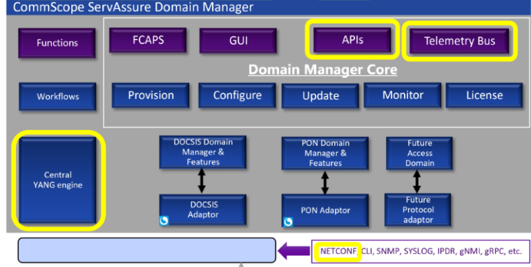
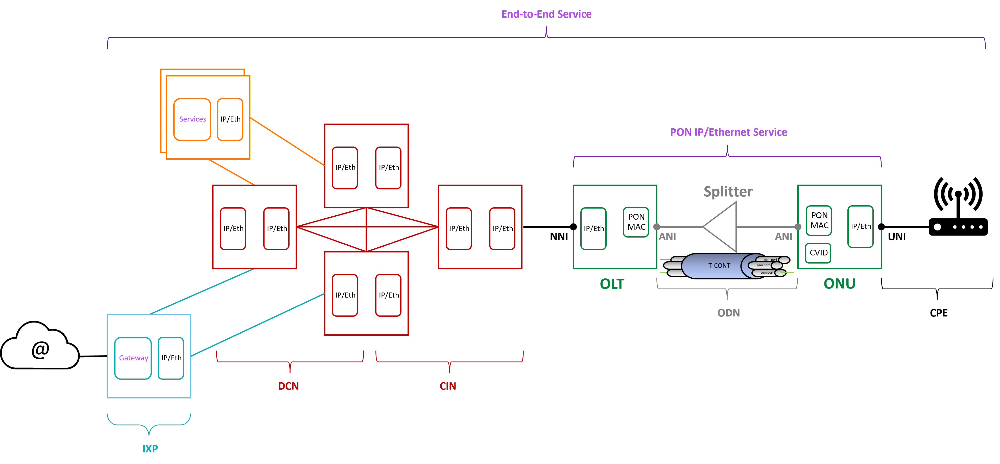
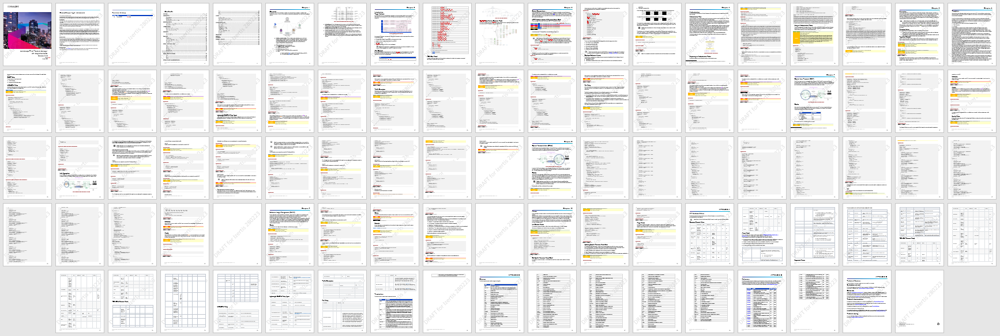
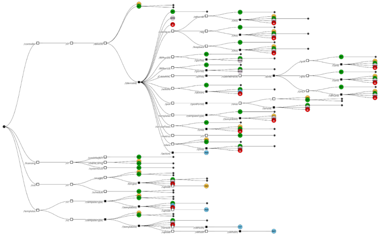
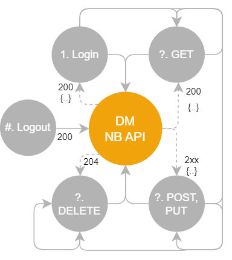
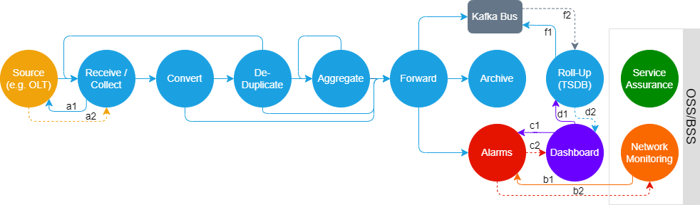
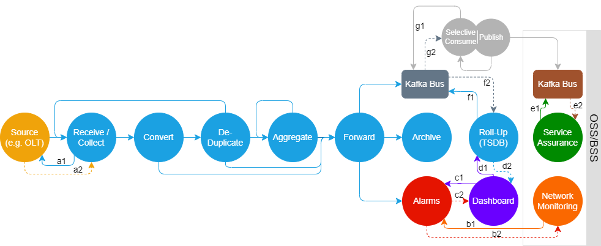
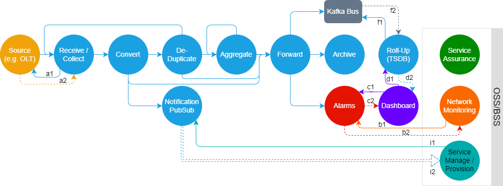

<!--- npx @marp-team/marp-cli@latest SE.md -o SE.pdf --pdf --allow-local-files --pdf-outlines --title "FLX™ PON - DM Northbound APIs, NETCONF/YANG & Telemetry"; npx @marp-team/marp-cli@latest SE.md -o SE.html --html --allow-local-files --title "FLX™ PON - DM Northbound APIs, NETCONF/YANG & Telemetry"; npx @marp-team/marp-cli@latest SE.md -o SE.pptx -->
<!-- backgroundImage: "linear-gradient(to bottom, #13aaed, #0801)" -->
# CommScope® FLX™ Domain Manager

## Northbound APIs, NETCONF/YANG & Telemetry

> lee cowdrey


<!-- footer: "FLX™ PON © 2023 CommScope, Inc. | Internal Confidential" -->
---
<!-- backgroundImage: "" -->
<!-- footer: "FLX™ PON © 2023 CommScope, Inc. | Internal Confidential" -->

# Session focus March 2023


- Northbound APIs
- NETCONF/YANG
- Telemetry
---

# PON End-to-End



---

# Northbound APIs

---

## API Intergation Guide



- [Draft](https://commscope.sharepoint.com/:b:/r/sites/TM_PONDeployment/Published%20PON%20Training%20%20CommScope%20Internal/FLX%20Soln%20Architecture%20%26%20Interfaces/DRAFT%20Domain%20Manager%202.1.0%20API%20Integration%20Guide.pdf?csf=1&web=1&e=BwwksS)

---

## API Integration Guide - Contents (1)

- Guide covers typical operations
  - Authentication
  - Pagination
  - Templates
  - OLT
  - ONU
  - Software Image Management
  - (DM) Alarms
  - API Attributes/Values
> Guide is human friendly version of supplied OpenAPI Specification
---

## Domain Manager APIs - PON focused


---

## API Integration Guide - Structure


---

<!-- backgroundImage: "" -->

## OpenAPI Specification (OAS)

> The OpenAPI Specification, previously known as Swagger, is a specification for a machine-readable interface definition language for describing, producing, consuming and visualizing web services
- Specification (service contract) can be formatted either as:
  - `JSON`
  - `YAML`
- [https://swagger.io/specification/](https://swagger.io/specification/)
  - Domain Manager currently conforming to version `3.0.3`

> OpenAPI is simply machine documentation

---

## Using OpenAPIs - Why & What

- API Gateway products can automatically digest OpenAPI definitions exposed by microservices and subsequently support there operation of (i.e. service-mesh routing, OSS/BSS service catalog and order management systems) without the need for complex integration activities
    - cloud based such as [AWS API Gateway](https://docs.aws.amazon.com/apigateway/latest/developerguide/api-gateway-import-api.html)
    - data centre based such as [Kong](https://konghq.com/blog/service-design-guidelines-with-openapi-and-kong-part-i) and [Apigee Edge API Proxy](https://docs.apigee.com/api-platform/tutorials/create-api-proxy-openapi-spec)
- Other products can generate *ready to use* code snippets from digested OpenAPI definitions for inclusion into source code, or actually generate full testing suites to verify definitions
> If an API design workflow is followed, it becomes single source of truth of all APIs reducing development effort

---

## OpenAPI Artifacts


- Generated with every release, Domain Manager OpenAPI service contract available from [https://arris.flexnetoperations.com/control/arrs/download?element=13837527](Flexera)
> *API Integration Guide* also available via Flexera as part of Domain Manager documentation set

---

## OpenAPI Editor (1)

- Available within Domain Manager UI
  - automatically includes OpenAPI service contract
  - URL path should contain `/halodocs/#`
  

---

## OpenAPI Editor (2)
- Available externally at [https://editor-next.swagger.io/](https://editor-next.swagger.io/)
  - requires manually loading of OpenAPI service contract
  
> Expected to be used by system integrators

---

## RESTful API Tooling

- Many tools/extensions available at zero cost for Linux, Windows and macOS platforms:
  - [Postman](https://www.postman.com/)
  - [Thunder Client](https://www.thunderclient.com/)
    - requires Microsoft [Visual Studio Code](https://code.visualstudio.com/)
  - [CURL CLI utility](https://curl.se/)
---

## Postman


---

## Thunder Client


---

## Domain Manager API Usage


- Connect (Login)
- Perform required operation
    - Repeat as necessary
- Disconnect (Logout)
> Authentication `access_token` automatically expires `expires_in`
---

## Domain Manager API Login Credentials

- Default
  - `client_id`: `test-client`
  - `client_secret`: `halo-test-client-secret`
  - `grant_type`: `client_credentials`
- New/deployment specific credentials can be created via KeyCloak Admin portal or `kc_createClient.sh` utility script

---

## Domain Manager API Login

- Method: `POST`
- URL: `https://{{dm-host}}:{{dm-port}}/auth/realms/halo/protocol/openid-connect/token`
- Request Body: x-www-form-urlencoded with `client_id={{u}}`,`client_secret={{p}}`,`grant_type={{t}}`
- Headers: `Accept: application/json` `Cache-Control: no-cache`
- Response Status code: `200 Ok`
- Response Body
```json
  { "access_token": "eyJhbGciOiJS...SMdxw", "expires_in": 300, "refresh_expires_in": 0,
    "token_type": "Bearer", "not-before-policy": 0, "scope": "email profile" }
```

---

## Domain Manager API Login - Postman Example


---

## Domain Manager API Login - CURL Example

```bash
$ export JWT_TMP=$(mktemp --quiet --suffix=.json --tmpdir=/tmp XXXXXXXX)
$ curl --insecure \
       -o ${JWT_TMP} \
       --connect-timeout 20 \
       --max-time 60 \
       --user-agent "halo-test/1.0" \
       --request POST \
       --header "Content-Type: application/x-www-form-urlencoded" \
       --header "Accept: application/json" \
       --header "Cache-control: no-cache" \
       --data "client_id=test-client" \
       --data "grant_type=client_credentials" \
       --data "client_secret=halo-test-client-secret" \
       "https://212.250.153.243/auth/realms/halo/protocol/openid-connect/token"
$ export JWT=$(jq -r ".token_type+\" \"+.access_token" ${JWT_TMP}) && rm -f ${JWT_TMP}
```
---

## Domain Manager API Operational

- Method: `GET`|`POST`|`PUT`|`DELETE`|`PATCH`
- URL: `https://{{dm-host}}:{{dm-port}}/...`
- Request Body: `raw` `{...}`
- Headers: `Authorization: Bearer {{access_token from login}}` `Accept: application/json` `Content-Type: application/json` `Cache-Control: no-cache`
- Response Status code: `2xx`
- Response Body: `{...}`
> available APIs as stated in Domain Manager API usage

---

## Domain Manager API Operational - Postman Example


---

## Domain Manager API Operational - Thunder Client Example


---

## Domain Manager API Operational - CURL Example

```bash
$ export GET_TMP=$(mktemp --quiet --suffix=.json --tmpdir=/tmp XXXXXXXX)
$ curl --insecure \
       -o ${GET_TMP} \
       --connect-timeout 20 \
       --max-time 60 \
       --user-agent "halo-test/1.0" \
       --request GET \
       --header "Accept: application/json" \
       --header "Cache-control: no-cache" \
       --header "Authorization: ${JWT}" \
       "https://212.250.153.243/controller/v1/devices?elementFamily=PON-OLT"
$ cat ${GET_TMP}|jq|head
{
  "numElements": 1,  "pageElements": 1,  "pageSize": 1000,  "pageNumber": 1,
  "devices": [
    {
      "elementName": "belf-dmz-olt","groupId": "Default", "description": "",
```

---

## Domain Manager API Logout
- Method: `GET`
- URL: `https://{{dm-host}}:{{dm-port}}/auth/realms/halo/protocol/openid-connect/logout`
- Request Body: none
- Headers: `Authorization: Bearer {{access_token from login}}` `Accept: */*` `Cache-Control: no-cache`
- Response Status code: `200 Ok`

---

## Domain Manager API Logout - CURL Example

```bash
$ curl \
    --insecure \
    -o /dev/null \
    --connect-timeout 20 \
    --max-time 60 \
    --user-agent "halo-test/1.0" \
    --request GET \
    --header "Accept: */*" \
    --header "Cache-control: no-cache" \
    --header "Authorization: ${JWT}" \
    "https://212.250.153.243/auth/realms/halo/protocol/openid-connect/logout"
```

---

<!-- backgroundImage: "linear-gradient(to bottom, #13aaed, #0801)" -->
# NETCONF/YANG

---

<!-- backgroundImage: "" -->
## What is Data Model?


- A data-model determines the structure, syntax and semantics of the data…
  - that is externally visible
  - Consistent and complete
- Protocol
  - Remote primitives to view and manipulate the data
    -Encoding of the data as defined by the data-model

---

## What is YANG (1)

- **YANG** is a **data modeling language** used to model configuration and state data manipulated by the **Network Configuration Protocol** (NETCONF), NETCONF remote procedure calls, and NETCONF notifications.
- **YANG 1.0** is defined in **RFC6020**.
  - Describe syntax and semantics of the YANG language
  - Also describe how a data model defined in a YANG module is encoded in the Extensible Markup Language (XML) and how NETCONF operations are used to manipulate the data
- **YANG 1.1** is defined in **RFC7950**
  - Describe syntax and semantics of version 1.1 of the YANG language
  - It is a maintenance release of the YANG language, addressing defects in the original specification - it does not obsolete RFC6020

---

## What is YANG (2)

- YANG modules can be translated into an equivalent XML syntax called YANG Independent Notation (YIN), allowing applications using XML parsers and Extensible Stylesheet Language Transformations (XSLT) scripts to operate on the models.
- YANG maintains compatibility with the Simple Network Management Protocol's (SNMP's) SMIv2. SMIv2-based MIB modules can be automatically translated into YANG modules for read-only access
- The YANG language was developed by the IETF NETCONF Data Modelling Language Working Group [NETMOD](http://www.ietf.org/html.charters/netmod-charter.html)

---

## Relationship between NETCONF and YANG

- The **NETCONF protocol** is a formal application programming interface (API) that allows configuration data information to be retrieved and manipulated
- The **YANG data modeling language** is used to model configuration and state data manipulated by NETCONF
- NETCONF is **not replacing** CORBA/SOAP/REST; it provides full set of semantics for configuration management
- YANG is **not replacing** XSD/RelaxNG/WSDL; it provides many features specific to configuration management

---

## SNMP vs. NETCONF

|                         | SNMP             | NETCONF           |
| ----------------------- | ---------------- | ----------------- |
| Standard                | IETF             | IETF              |
| Resources               | OIDs             | Paths             |
| Data Models             | Defined in MIBs  | YANG Core Models  |
| Data Modelling Language | SMI              | YANG              |
| Management Operations   | SNMP             | NETCONF           |
| Encoding                | BER              | XML               |
| Transport  Stack        | UDP              | SSH, TCP          |

---

## NETCONF and YANG in Context


---

## YANG Module Contents


---

## YANG Module


---

## XGS-PON YANG for Shelf OLT


---

## XGS-PON Configuration for Shelf OLT


---

## 4 Hours of NETCONF/YANG Training

- [Part 1](https://commscope.sharepoint.com/:v:/r/sites/TM_PONDeployment/Published%20PON%20Training%20%20CommScope%20Internal/YANG%20%26%20NETCONF/part1of2.mp4?csf=1&web=1&e=1wO9Wi)
- [Part 2](https://commscope.sharepoint.com/:v:/r/sites/TM_PONDeployment/Published%20PON%20Training%20%20CommScope%20Internal/YANG%20%26%20NETCONF/part2of2.mp4?csf=1&web=1&e=j2jU2K)
- [ietf-interfaces@2018-02-20.yang](https://commscope.sharepoint.com/:u:/r/sites/TM_PONDeployment/Published%20PON%20Training%20%20CommScope%20Internal/YANG%20%26%20NETCONF/ietf-interfaces@2018-02-20.yang?csf=1&web=1&e=zWJjhQ)
- [ietf-yang-types@2013-07-15.yang](https://commscope.sharepoint.com/:u:/r/sites/TM_PONDeployment/Published%20PON%20Training%20%20CommScope%20Internal/YANG%20%26%20NETCONF/ietf-yang-types@2013-07-15.yang?csf=1&web=1&e=t9nxTq)
- [YANG_Cheat_Sheet.pdf](https://commscope.sharepoint.com/:b:/r/sites/TM_PONDeployment/Published%20PON%20Training%20%20CommScope%20Internal/YANG%20%26%20NETCONF/YANG_Cheat_Sheet.pdf?csf=1&web=1&e=jc81SM)
- [yangPrimer.pdf](https://commscope.sharepoint.com/:b:/r/sites/TM_PONDeployment/Published%20PON%20Training%20%20CommScope%20Internal/YANG%20%26%20NETCONF/yangPrimer.pdf?csf=1&web=1&e=RDvzGH)

---

<!-- backgroundImage: "linear-gradient(to bottom, #13aaed, #0801)" -->
# CommScope Domain Manager (CSDM)
# with NETCONF & OLT Operations

---

<!-- backgroundImage: "" -->
<!-- footer: "FLX™ PON © 2023 CommScope, Inc. | Internal Confidential" -->

### OLT - NETCONF Mount Operation


- NETCONF hello handshake
- Exchange capabilities
- Retrieve current configuration
- Retrieve unknown YANG
- Subscribe to all available notifications
---

### OLT - NETCONF Edit Operation (1/5) - Two Phase Commit


- Lock datastore
    - If already locked, disconnect
---

### OLT - NETCONF Edit Operation (2/5)


- Edit configuration
  - Auto rollback on error
    - Force discard if error (unlock datastore)
    - Disconnect
  - Operation (merge|replace)
---

### OLT - NETCONF Edit Operation (3/5)


- Request configuration is validated
    - Force discard if error (unlock datastore)
    - Disconnect
---

### OLT - NETCONF Edit Operation (4/5)


- Commit changes to running datastore
    - Force discard if error (unlock datastore)
    - Disconnect
---

### OLT - NETCONF Edit Operation (5/5)


- All changes delivered & validated without error
- Unlock datastore
- Disconnect
---

### OLT - NETCONF Keep-Alive Operation


- Periodic nudge
    - Get configuration
> keep connection open for (inband) notifications
---

### OLT - NETCONF Unmount Operation


- Disconnect
- Remove local notification subscriptions
---

### OLT - UI - Operational Status


---

### OLT - UI - Normal Operation


---

### OLT - UI - Degraded Operation


---

<!-- backgroundImage: "linear-gradient(to bottom, #13aaed, #0801)" -->

# Telemetry

---

<!-- backgroundImage: "" -->
<!-- footer: "FLX™ PON © 2023 CommScope, Inc. | Internal Confidential" -->

## Basic Principle



---

## Publication to External Kafka Bus



> *currently under PLM/Architecture discussion*

---

## Custom Notifications & Metrics Integration


> customer funded integration that requires Scope of Works & High Level Design

---

## PubSub Notification Streams



> initially unknown ONU discovery (OLT id&port, ANI, ONU serial&make/model)
> *currently under PLM/Architecture discussion*

---

## Domain Manager Usage


- TSDB is used as source data by `PON History` under UI Monitoring section
  - `OLT GEM Port Metrics`
  - `OLT Interface Metrics`
  - `OLT Single Interface`
  - `ONU Interface Metrics`
> TSDB is not available externally, defer to Kafka

---

## OLT GEM Port Metrics


---

## OLT Interface Metrics


---

## OLT Single Interface


---

## ONU Interface Metrics


---


<!-- backgroundImage: "linear-gradient(to bottom, #13aaed, #0801)" -->
<!-- footer: "FLX™ PON © 2023 CommScope, Inc. | Internal Confidential" -->

#### Thank you

> lee cowdrey

[+44-777-328-1821](tel:+447773281821)
[lee.cowdrey@commscope.com](mailto:lee.cowdrey@commscope.com)

> corporate headquarters

CommScope · Hickory · North Carolina · 28602 · USA
[+1-828-324-2200](tel:+18283242200)

[www.commscope.com](https://www.commscope.com)